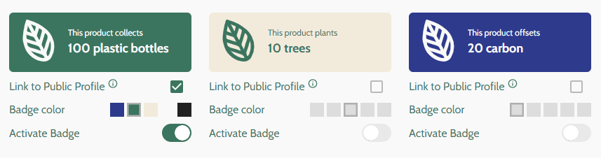

# Material Widgets

A collection of ecological material widgets.



## Description

_TypeScript_ has been used as the main programming language, providing a robust foundation for enforcing type safety throughout the codebase. The user interface is created using _React_ along with _MUI_ (Material UI), a versatile component library.

To manage the application's state in a predictable and efficient manner, a combination of _Zustand_ and _Immer_ has been used. _Zustand_ allows the creation of an immutable global state, serving as a single source of truth for the application. _Immer_ enhances the state management process by enabling the creation of immutable data structures in a more intuitive and concise manner.

The rendering process is characterized by a unidirectional flow of data. As data is fetched from the external API, it is saved into the global immutable state. This ensures that the application maintains a consistent and synchronized representation of the data across all components. The widget components receive their properties and settings from this global state. When a change in settings occurs within a widget component, the global state is updated first. Subsequently, this modification triggers the re-rendering of the affected widget, allowing it to seamlessly reflect the latest changes. This synchronous relationship between the global state and the widget components ensures a responsive and up-to-date user interface.

In summary, the use of _TypeScript_, _React_ with _MUI_, _Zustand_, and _Immer_ collectively contributes to a scalable, maintainable, and type-safe architecture. The global immutable state acts as a cornerstone, facilitating seamless communication between components and enabling a dynamic user experience that effortlessly adapts to evolving data and user interactions.

## Instructions

**1.** First clone the project from GitHub:

```bash
git git@github.com:michaelkolesidis/widgets.git
cd widgets
```

**2.** Install the project dependencies:

```bash
yarn
```

**3.** Start the Vite development server:

```bash
yarn dev
```

### Demo

There is an online demo available at [https://materialwidgets.vercel.app/](https://ecologicalwidgets.vercel.app/). It is deployed using [Vercel](https://vercel.com/).

## Technologies

The core technologies are TypeScript, React, MUI, and Zustand. The following libraries and tools are used:

| Name         | License          | Description                                                       |
| ------------ | :--------------: | ----------------------------------------------------------------- |
| TypeScript   |   MIT            | A strongly typed language that builds on JavaScript               |
| React        |   MIT            | Component-based, front-end interface library                      |
| MUI          |   MIT            | React component library                                           |
| Zustand      |   MIT            | State management                                                  |
| Immer        |   MIT            | Allows you to work with immutable state in a more convenient way. |
| Vite         |   MIT            | Frontend development tooling                                      |
| Volta        |   BSD-2-Clause   | JavaScript tool manager                                           |
| Yarn         |   BSD 2-Clause   |   Package manager                                                 |

## Software Used

A non-exhaustive list of software that was used during the development of the project.

- Visual Studio Code
- Figma
- Google Chrome
- Microsoft Edge
- Mozilla Firefox

## 💖 Support the Project

Thank you so much for your interest in my project! If you want to go a step further and support my open source work, buy me a coffee:

<a href='https://ko-fi.com/michaelkolesidis' target='_blank'></a>

## License

<a href="https://www.gnu.org/licenses/agpl-3.0.html"></a>

Copyright (c) 2023 Michael Kolesidis<br>
Licensed under the [GNU Affero General Public License v3.0](https://www.gnu.org/licenses/agpl-3.0.html).
